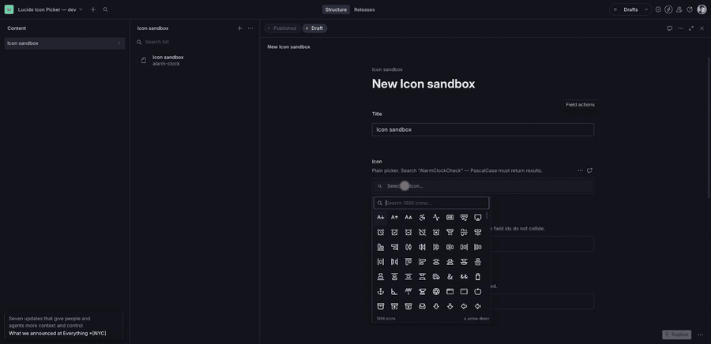

<div align="center">
  <h1>Sanity Lucide Icon Picker</h1>
  <h3>A beautiful icon picker plugin for Sanity Studio with 1,600+ Lucide icons.</h3>
  <p><em>Originally developed by <a href="https://contentwrap.io" target="_blank">ContentWrap</a> — this fork is maintained by <a href="https://kodamera.se" target="_blank">Kodamera</a></em></p>

  
  
  
  

  <br>
  <br>

  
</div>

---

## About this fork

This is a maintained fork of
[`contentwrap/sanity-plugin-lucide-icon-picker`](https://github.com/contentwrap/sanity-plugin-lucide-icon-picker),
published as `@kodamera/sanity-plugin-lucide-icon-picker`. All credit for the
original plugin goes to [ContentWrap](https://contentwrap.io); it remains MIT
licensed and their copyright notice is retained in `LICENSE`.

**Why it exists.** Sanity moved from `@sanity/ui` v3 to v4 in **sanity@6.10.0**,
and v4 moved `Menu`, `MenuItem`, `Popover` and `Autocomplete` out of the package
root into subpath exports (`@sanity/ui/menu`, `@sanity/ui/popover`,
`@sanity/ui/autocomplete`). `@sanity/icons` v5 did the same thing. The original
plugin imports all of them from the package root, so on Sanity 6.10+ it either
fails to build or silently pulls a second copy of `@sanity/ui` into the Studio —
which breaks layout in ways that are very hard to trace. Upstream has had no
release since August 2025 and three open pull requests, none of which address
this.

**What changed:** the imports, the peer ranges, and a `lucide-react` bump to 1.x.
The component behaviour and API are unchanged.

### Which version do I want?

| Your Sanity | `@sanity/ui` | Use |
|---|---|---|
| 3.x – 6.9 | v2 / v3 | the original [`sanity-plugin-lucide-icon-picker`](https://www.npmjs.com/package/sanity-plugin-lucide-icon-picker) — it works fine there |
| **6.10+** | **v4** | **this package** |

This fork targets `@sanity/ui` v4 only. The two versions cannot be supported from
one package: the subpath exports do not exist in v3, and the root exports do not
exist in v4, so no single import statement resolves on both.

---

## Features

- **1,600+ icons**: Access to the complete Lucide Icons library
- **Smart search**: Quickly find icons with intelligent search functionality
- **Responsive design**: Works seamlessly on desktop and mobile devices
- **High performance**: Virtualized rendering and lazy loading for smooth experience
- **Configurable**: Flexible options for filtering icons
- **Preview support**: Built-in preview function for Sanity Studio

---

## Installation

```sh
pnpm add @kodamera/sanity-plugin-lucide-icon-picker
# or
yarn add @kodamera/sanity-plugin-lucide-icon-picker
# or
npm install @kodamera/sanity-plugin-lucide-icon-picker
```

---

## Usage

**1. Add the plugin to your Sanity config:**

```ts
// sanity.config.ts
import { defineConfig } from 'sanity';
import { lucideIconPicker } from '@kodamera/sanity-plugin-lucide-icon-picker';

export default defineConfig({
  // ...
  plugins: [lucideIconPicker()],
});
```

**2. Use the `lucide-icon` type in your schema:**

```ts
// schemas/myDocument.ts
import { defineType } from 'sanity';

export default defineType({
  name: 'myDocument',
  title: 'My Document',
  type: 'document',
  fields: [
    {
      name: 'icon',
      title: 'Icon',
      type: 'lucide-icon',
    },
    // ... other fields
  ],
});
```

---

## Configuration Options

### Icon Filtering

Limit available icons to a specific whitelist:

```ts
{
  name: 'icon',
  title: 'Social Icon',
  type: 'lucide-icon',
  options: {
    allowedIcons: ['facebook', 'twitter', 'instagram', 'linkedin'],
  }
}
```

The `allowedIcons` option accepts an array of icon names (in kebab-case format) to show only those specific icons in the picker.

---

## Frontend Integration

### React with DynamicIcon

Icons are stored as kebab-case strings (e.g., `"arrow-right"`, `"chevron-down"`). Use Lucide's `DynamicIcon` component to render them:

```jsx
import { DynamicIcon } from 'lucide-react/dynamic';

// Your Sanity data
const iconName = 'arrow-right'; // from your Sanity document

// Usage
export default function MyComponent() {
  return (
    <div>
      <DynamicIcon name={iconName} size={24} />
    </div>
  );
}
```

---

## Performance

The plugin is optimized for performance with:

- **Virtualized rendering** - Only visible icons are rendered
- **Lazy loading** - Icons load on-demand
- **Efficient search** - Fast text-based search with debouncing
- **Tree shaking** - Only imported icons are included in your bundle

For optimal frontend performance:

1. Use dynamic imports to load only needed icons
2. Consider using the `allowedIcons` option to limit available icons

---

## Requirements

- Sanity Studio v3 or v4
- React 18 or 19
- TypeScript (recommended)

---

## License

MIT © ContentWrap

---

## About the Developer

This package is developed and maintained by [ContentWrap](https://contentwrap.io), a digital product agency specializing in Sanity and modern web development.
